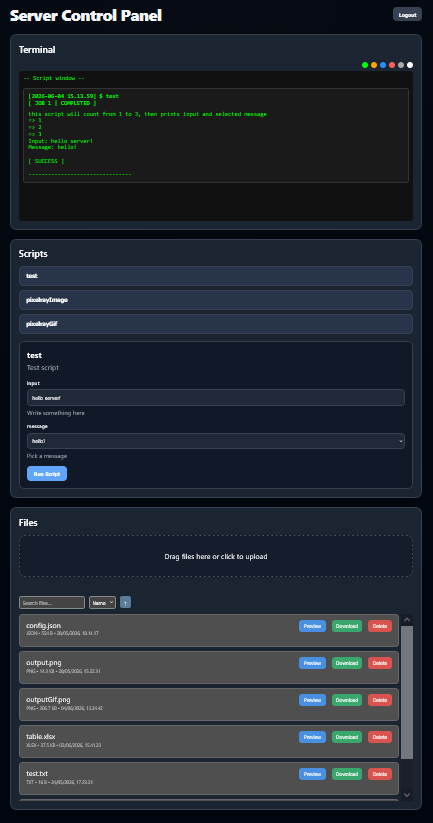

# Simple and compact LAN server tool for Linux

<p align="center">
  
  <em>Browser UI for index page</em>
</p>

---

- Backend server runs on C23 (gcc compiles with `-std=gnu2x` flag) build on top of Linux network socket API
- Frontend browser user interface uses vanilla Html + Css + JS files which it requests from the server

> While the server itself is for Linux only, Windows users can easily run it inside [WSL](https://learn.microsoft.com/en-us/windows/wsl/install)
>
> - If you use Windows 10, I would recommend downgrading to WSL version 1 in order avoid network connection loss issues when downloading anything inside WSL
> - On Windows 11 both version 1 and 2 are fine


## Table of contents

- [<u>Features</u>](#features)
- [<u>Makefile</u>](#makefile)
- [<u>Server setup</u>](#server-setup)
- [<u>Adding new scripts</u>](#adding-new-scripts)
- [<u>References</u>](#references)


## Features

Might be missing something here, but these should cover the most important ones:

#### Server
- uploading, downloading and deleting. File transfer operations support arbitrary file sizes and formats
- scripting support
    - scripts have 3 different routes: execution, status polling and text output access
    - importantly backend can build json responses from script structs for frontend. Frontend then dynamically 
    generates its own input forms from this data for each script
- threaded client operations
    - file uploading, downloading and running scripts don't directly interfere with one another. 
    - simple mutex+locking for preventing race conditions
- cookie-based token authentication: this serves as a small but nonetheless useful security layer
- `config/server.conf` file for updating port and auth token
    - **remember to update the TOKEN value for actual use and do not upload it to the server!**
- routes are listed in `src/http/routing.c`. Here you can change which routes require auth permissions 
(change `AUTH` to `PUBLIC`)

#### Web UI
- login/logout with auth token 
    - cookies don't define Max-Age/Expires attribute which means they get deleted when current sessions ends. This can 
    mean various lengths, even infinite lifetime; see 
    [this MDN section](
        https://developer.mozilla.org/en-US/docs/Web/HTTP/Guides/Cookies#removal_defining_the_lifetime_of_a_cookie
        ) 
    for more details
- script API with an output window. Multiple scripts can be run simultaneously
    - clicking at script button opens a auto-generated web form where user can type the input args
    - output text color has 6 pre-defined variants to select from. These can be easily edited in index.html 
    (button visuals) + style.css (the text itself)
- file storage
    - uploading supports multiple files (browse+select or drag & drop) and displays progress for each upload queue 
    individually
        - each upload queue includes its own progress bar with a cancel button
    - display all uploaded server files in a list structure which auto-updates on file changes. Files include 
    metadata (name, type, size, upload date)
    - each file has `Preview`, `Download` and `Delete` buttons
        - previews don't automatically work for all file formats, but do support the most common ones. Both 
        `src/http/mime.c` and `public/app.js -> TEXT_FORMATS + togglePreview` can be used for expanding this functionality
    - simple search and sorting (name/type/size/date + ascending/descending)


## Makefile

Project uses a simple Makefile with gcc. 

The *strdup* function is required for string duplication which was added in C23. Some slightly older gcc versions 
might not directly support gnu23 hence `-std=gnu2x` flag is used instead.

Following make commands are thus available:

- `make build` => builds src into `bin/lan-server`
    - `make` also works by itself (default to building)
- `make server` => first builds then starts the server with `./bin/lan-server`
- `make tests` => builds tests into `bin/tests`
- `make test` => first builds then runs the test suite with `./bin/tests`
- `make clean` => deletes both lan-server and tests files from bin

For simplest setup: just use `make server` to run the server

> Server has no remote stop command yet; use **Ctrl + C** in terminal to shut it down


## Server setup

### server.conf

To set port and login auth token, edit `config/server.conf`:

    PORT=8080
    TOKEN=secret-token

Make sure to update TOKEN value: even though this is just a lan server tool, it never hurts to have an additional 
safety layer.

Default PORT is fine. If you have other servers using this, feel free to replace it.

### running the server

You can simply run server with Makefile using `make server` (this builds file into bin directory then executes ./bin/lan-server)

You can also move lan-server file elsewhere, just make sure you have all required directory dependencies then run 
it as executable.

For example if your root is called `my-server` then you need

```
my-server/  
  lan-server (executable)
  config/ (server.conf defines port + auth token)
  uploads/ (file storage)
  public/ (Web UI; optional, but you most likely want this)
```

Also it's important you run executable relative to root dir, otherwise server can't find config file. For example: 
if your executable is still at "bin/lan-server", you need to use command `./bin/lan-server` from root; 
simply changing dir into "bin" and running ./lan-server fails.

=> to keep it simple: either use `make server` (recommended) or have executable in root dir.

### connecting to server

You can first test connecting via ip normally. If this doesn't work, you can always rely on VPNs such as
- ZeroTier
- TailScale
- WireGuard, etc.

In general:

- if you run server on localhost (= host and users on same machine), use `http://localhost:PORT_NUMBER/`
- otherwise make sure your host server machine and main PC are in same local network, then connect to host via 
local IPv4 address e.g. `http://192.168.1.1:PORT_NUMBER/`
    
    Here you replace the ipv4 and port your host address + the port you defined in server.conf. To find ip, 
    use one of the following commands:
    - Windows: 
        - cmd -> `ipconfig`, find line `IPv4 Address ... : 192.168.x.x`
        - powershell -> `Get-NetIPAddress`
    - Linux:
        - bash -> `hostname -I`


## Adding new scripts

In this example I use my [PixelRay](https://github.com/j-miet/PixelRay) ray tracer project to add a server script 
which can generate gif animations from json and lua files. It reads the inputs from server's `uploads` directory and 
produces the output gif into same location.

---

In `api/script_api.c`, the are two structs: `ScriptField script_test` and `ScriptEntry scripts`:

```C
ScriptField script_test[] = {{"input", "text", "Write something here", 1, {NULL}},
                            {"message", "select", "Pick a message", 0, {"hello!", "bye!", NULL}},
                            {NULL}};

ScriptEntry scripts[] = {
    { "test", "./scripts/test.sh", "Test script", script_test},
    { NULL, NULL, NULL, NULL}
};
```

- ScriptEntry lists all available scripts. Each requires name, path, description and a ScriptField struct for passed 
args. Final entry must be a list of NULLs so that the build-in json parser knows where to stop parsing.
- ScriptField lists each args as a list. List includes 
    - arg name
    - type (`"text"` for free input, `"select"` for a dropdown select with pre-defined values)
    - description
    - required check: `1` is input is required, `0` if optional
    - "select" type options. If type is "text", then replace this array with `{NULL}`. Otherwise list all options and 
    finish with a NULL value e.g. in script_test, two values are used, "hello!" and "bye!", which generates array 
    like this: `{"hello!", "bye!", NULL}`

Now ScriptEntry is build into a json string which gets fed to browser, where in app.js, javascript builds the scripting UI 
dynamically based on these values.

Now we'll add a new script called **pixelrayGif** into ScriptEntry: this script runs the PixelRay executable which 
requires inputs for
- static scene creation file (json)
- script file for animations (lua)
- amount of animation frames (integer value)

> Script API can't perform further type validations, it only sees string values.  The script itself should perform safety checks if necessary; more on this later.

In this case, each input field should accept a free input so all of them will use type `"text"`. Each arg is also 
required in order to run the script so set the 4. value as `1` which corresponds to boolean true.

Thus ScriptField becomes like this:

```C
ScriptField pixelrayGif[] = {{"input", "text", "scene file <scene>.json", 1, {NULL}},
                             {"lua", "text", "lua script file <script>.lua", 1, {NULL}},
                             {"frames", "text", "animation frame count", 1, {NULL}},
                             {NULL}};
```
Script itself runs as `pixelrayGif.sh` so ScriptEntry becomes like this:


```C
ScriptEntry scripts[] = {
    { "test", "./scripts/test.sh", "Test script", script_test},
    { "pixelrayGif", "./scripts/pixelrayGif.sh", "Generate a gif animation", pixelrayGif},
    { NULL, NULL, NULL, NULL}
};
```

where the bash file `pixelrayGif.sh` looks like this:

```bash
#!/bin/bash

# custom 'external/PixelRay' dir added for PixelRay executable and copied temp files
if [ ! -d "external/PixelRay" ]; then
    echo "Couldn't find PixelRay dir"
    exit 1
fi

cd "./external/PixelRay"

# use basename: this parses path and ends up with only the file name in order to avoid paths like "../"
# this script will not check validity of file formats (scene is .json, lua is .lua) because PixelRay does this already
SCENE=$(basename "$1")
LUA=$(basename "$2")

# abort script if user tries to input 'pixelray' in any casing. This is to later prevent
# - overriding executable when temp file gets copied
# - deletion of executable when temp is removed (technically this can never even happen if override condition is properly checked)
if [ "${SCENE,,}" = "pixelray" ] || [ "{$LUA,,}" = "pixelray" ]; then
    echo "Can't use name 'pixelray' in scene or script files"
    exit 1
fi

# check that passed frame value is an integer
FRAMES="$3"
if [[ ! $FRAMES =~ ^-?[0-9]+$ ]]; then
    echo "frames must be an integer value"
    exit 1
fi

# to avoid complicating file paths and adding possible security issues: 
# - allow only file names in paths (this was done earlier with basename)
# - copy the scene and script files from 'uploads' dir into 'external/PixelRay'
# - run script using direct file names
# - move output gif to 'uploads'
# - clean up by deleting PixelRay's auto-generated frame images in 'frames' dir + the temp copies of used scene and lua script
cp ../../uploads/$SCENE $SCENE
if [ $? != 0 ]; then
    echo "Scene file copying failed"
    exit 1
fi

cp ../../uploads/$LUA $LUA
if [ $? != 0 ]; then
    echo "Lua script file copying failed"
    exit 1
fi

chmod +x PixelRay
./PixelRay -i $SCENE -s $LUA $FRAMES -g -u 0

mv -- "outputGIF.gif" "../../uploads"

if [ ! -d "frames" ]; then
    echo "Couldn't find frames dir after script completion!"
    exit 1
else
    rm -r "frames"
fi

rm -- "$SCENE"
rm -- "$LUA"
```

After a script has been added:
- create `external/PixelRay` directory and place PixelRay Linux executable here i.e. full path is 
now `external/PixelRay/PixelRay`
    - remember to `chmod +x PixelRay`, otherwise you will get an error when attempting to call the script
- close and then `make server` to rebuild + run the server
- refresh web UI and you should see the button `pixelrayGif` under scripts. Clicking this opens the auto-generated 
input form similarly to `test` script where you can pass args and execute the script


## References

#### C

- [Beej's Guide to Network Programming](https://beej.us/guide/bgnet/)
    - Beej's other guides are very good as well, they can be found [here](https://beej.us/guide)
- [The Open Group](https://pubs.opengroup.org/onlinepubs/7908799/)
- [Linux man pages](https://man7.org/linux/man-pages/)
- [Linux.die.net](https://linux.die.net/)
- [devdocs](https://devdocs.io/c/)
- [cppreference](https://en.cppreference.com/c/header)

#### Web

[MDN Web docs](https://developer.mozilla.org/en-US/docs/Web)

In particular
- [HTTP](https://developer.mozilla.org/en-US/docs/Web/HTTP)
- [Response status codes](https://developer.mozilla.org/en-US/docs/Web/HTTP/Reference/Status)
- [Common media types (MIME)](https://developer.mozilla.org/en-US/docs/Web/HTTP/Guides/MIME_types/Common_types)
